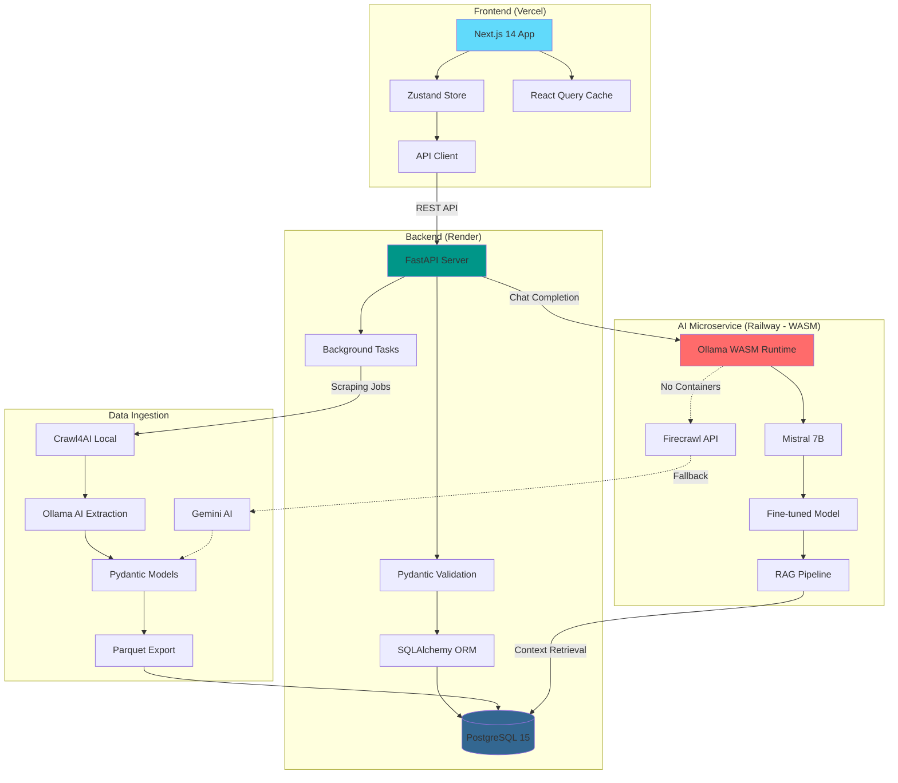

# Hi 👋 I'm Harry Joseph

### Application Support Analyst | DevOps Engineer | Full-Stack Developer

🌍 **Based in:** Canada  
💼 **Experience:** 15+ years in IT & Application Support  
🎓 **Focus:** Full-stack development, AI/LLM applications, DevOps automation  
💡 **Currently:** Building production-grade AI-powered web applications

[](https://linkedin.com/in/your-profile)
[](mailto:hjoseph777@gmail.com)
[](https://github.com/hjoseph777)

---

## 🚀 Featured Projects

### 🎓 [CourseCompass](https://github.com/hjoseph777/Compass) — AI-Powered Academic Navigation Platform
> **Current Dev| Production-Ready Mid 2026 |Author developer Harry Joseph*

An intelligent platform helping Ontario students discover, compare, and plan educational pathways across postsecondary institutions. **Think "Google for college programs" with AI counselling.**

**Tech Stack:**
- **Frontend:** Next.js 14, TypeScript, Tailwind CSS, Zustand, React Query
- **Backend:** FastAPI, SQLAlchemy 2.0, Pydantic v2, PostgreSQL 15
- **AI/ML:** Ollama (Mistral 7B), Gemini AI, LLM-powered data extraction
- **DevOps:** Docker, Docker Compose, Alembic migrations, GitHub Actions
- **Data Engineering:** Firecrawl, custom web scrapers, ethical data collection

**Key Features:**
- 🔍 Search & compare 228+ programs across Ontario institutions
- 🤖 AI counsellor with 24/7 conversational guidance
- 📊 Real-time career outcomes (salaries, employment rates, job titles)
- 🎯 Side-by-side program comparison with 4,000+ course descriptions
- 🔐 Google OAuth authentication with user favorites system
- 📱 Responsive UI with dark mode support

**Architecture Highlights:**
- Three-tier architecture (Next.js → FastAPI → PostgreSQL)
- RESTful API with OpenAPI documentation (`/docs`)
- UUID-based data models with hierarchical relationships
- Ethical web scraping with rate limiting & robots.txt compliance
- Multi-cloud deployment strategy (Vercel + Render + Railway)

**Detailed Architecture Diagram:**



**Data Pipeline:**
```
College Websites → Crawl4AI + Ollama → Pydantic Validation → Parquet → PostgreSQL → RAG → Mistral 7B
                ↳ Firecrawl + Gemini AI (fallback)
```

**Impact:** Aggregates 4,000+ courses from multiple institutions into a single searchable platform, reducing program discovery time from hours to minutes.

---

### 🚌 [Mobile Punch Clock](https://github.com/hjoseph777/MobilePunchClock) — Cross-Platform Time Tracking
> **C# | .NET MAUI | Cloud-Native**

Full-stack mobile application for bus drivers to log driving/non-driving hours with automatic 15-minute interval rounding.

**Key Features:**
- Cross-platform (Android/iOS) with .NET MAUI
- Cloud-based time synchronization
- Accurate time calculation with automatic rounding
- Offline-first architecture with sync capability

⭐ **4 stars** | Used by real transit drivers for daily time management

---

### 🎬 [MoviesLand](https://github.com/hjoseph777/MoviesLand) — Movie Discovery Application
> **React | JavaScript | OMDB API**

Dynamic movie search platform with real-time API integration.

**Features:**
- Real-time movie search with OMDB API
- Responsive UI with poster galleries
- Filter by genre, year, and rating
- Detailed movie information cards

---

### 📚 [AH BookStore](https://github.com/hjoseph777/AHBookStoreFinalProject) — E-Commerce Platform
> **Python | Django | PostgreSQL**

Full-featured online bookstore with shopping cart and payment integration.

**Features:**
- User authentication & authorization
- Shopping cart with session management
- Inventory management system
- Admin dashboard for order processing

---

### 🍽️ [Cherry Hill Restaurant Feedback](https://github.com/hjoseph777/CherryHillRestaurantFeedback) — Customer Feedback System
> **TypeScript | React | Firebase**

Real-time customer feedback platform with analytics dashboard.

**Features:**
- Real-time sentiment analysis
- Interactive dashboard with charts
- Customer satisfaction tracking
- Manager notification system

---

### ☁️ [Weather Dashboard](https://github.com/hjoseph777/WeatherDashboard) — Weather Forecast Application
> **JavaScript | OpenWeatherMap API**

Multi-city weather tracking with forecast visualization.

**Features:**
- 5-day weather forecasts
- Multiple location tracking
- Dynamic weather icons
- Responsive design

---

## 💻 Technical Skills

### Languages


### Frameworks & Libraries
**Frontend:** Next.js 14, React, Angular, Zustand, React Query, Tailwind CSS  
**Backend:** FastAPI, Django, Node.js, Express, .NET Core  
**AI/ML:** Ollama, LangChain, OpenAI GPT, Whisper, Gemini AI  
**ORM/Database:** SQLAlchemy 2.0, Alembic, PostgreSQL, Oracle DB

### DevOps & Cloud
**Platforms:** AWS, Google Cloud, Azure, Vercel, Render, Railway  
**Containers:** Docker, Docker Compose  
**CI/CD:** GitHub Actions  
**Monitoring:** Splunk, Datadog, IBM ITRS Geneos, Prometheus, Grafana  
**Version Control:** Git, GitHub

### Tools & Methodologies
- **Testing:** Pytest, Jest, unittest, functional testing
- **API Design:** RESTful APIs, OpenAPI/Swagger, FastAPI documentation
- **Databases:** PostgreSQL, Oracle, MySQL, Redis
- **Data Engineering:** Web scraping (BeautifulSoup, Selenium, Firecrawl), ETL pipelines
- **ITSM:** ServiceNow, ITIL v4, Incident/Problem Management
- **Agile:** Scrum, Kanban, Jira

---

## 🏢 Professional Experience

**15+ Years in IT & Application Support**

- **Application Support Analyst** — Expertise in monitoring critical systems (IBM Z, ITRS Geneos, Splunk)
- **DevOps Engineer** — Infrastructure automation, CI/CD pipelines, cloud deployment
- **Enterprise Experience** — TD Bank, BMO Financial, Rogers Communications
- **Compliance & Security** — AML (Anti-Money Laundering) system monitoring, incident response
- **ITIL Certified** — Incident, problem, and change management

**Key Achievements:**
- ✅ Maintained 99.9% uptime for critical banking applications
- ✅ Automated deployment pipelines reducing release time by 60%
- ✅ Built AI-powered tools for real-time customer support analysis
- ✅ Migrated legacy applications to cloud-native architectures

---

## 🎯 Current Focus

🌱 **Learning:** Advanced React patterns, microservices architecture, Kubernetes  
🔭 **Building:** AI-powered business automation tools with LLMs  
🤝 **Open to:** Collaborating on full-stack AI applications, DevOps automation projects  
💬 **Ask me about:** FastAPI, Next.js, PostgreSQL, Docker, AI/LLM integration, application monitoring

---

## 🌍 Languages

- 🇬🇧 **English** — Native
- 🇫🇷 **French** — Fluent
- 🇪🇸 **Spanish** — Conversational

---

## 📊 GitHub Statistics

<div align="center">
  


</div>

---

## 🏆 Contribution Highlights

- 📦 **125 Public Repositories** — Active open-source contributor
- 🎯 **798 Contributions** (Last Year) — Consistent development activity
- ⭐ **Featured Projects** — MobilePunchClock, CourseCompass, MoviesLand
- 🌟 **Recent Work** — AI-powered applications with production-grade architecture

---

## ⚡ Fun Facts

- 🎬 Enjoy thriller movies and analyzing plot structures
- ⚽ Soccer enthusiast — watch and play
- 🧠 Passionate about system architecture and scalable design patterns
- 🌱 Always learning new tech stacks — currently exploring AI/LLM applications
- 🤖 Building AI agents for real-world business problems

---

## 📫 Let's Connect!

I'm always interested in discussing:
- 💼 **Job opportunities** in full-stack development, DevOps, or AI/ML engineering
- 🤝 **Collaboration** on open-source AI/web applications
- 💡 **Tech discussions** about system architecture, cloud deployment, or LLM integration
- 🎓 **Mentorship** in application support, DevOps practices, or full-stack development

**Reach out:**
- 📧 Email: [hjoseph777@gmail.com](mailto:hjoseph777@gmail.com)
- 💼 LinkedIn: [Connect with me](https://linkedin.com/in/your-profile)
- 🌐 Portfolio: [github.com/hjoseph777](https://github.com/hjoseph777)

---

<div align="center">

### 🚀 "Building intelligent systems that solve real-world problems"


</div>
